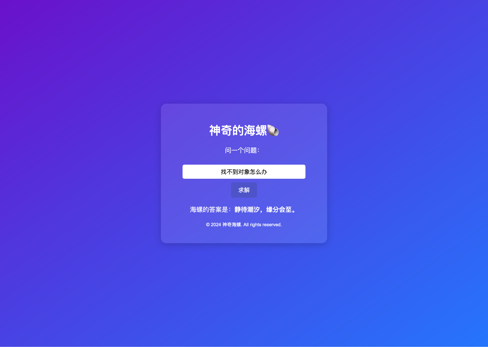

# 神奇的海螺
一个智慧的问答系统，能够通过调用大模型接口来回答用户的问题。  

默认配置使用ChatGLM模型，只需在`main.go` 12-14行修改常量即可
服务运行端口为2000，如需更改端口，请修改第44行的代码。
## 使用方法
1. 下载代码
2. 安装依赖
   ```shell
   go mod tidy
   ```
3. 运行代码
   ```shell
   go run main.go
   ```
4. 访问http://127.0.0.1:2000/
